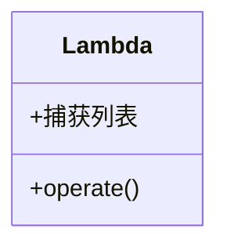

# thread_pool
## mermaid test

```mermaid
classDiagram
class Lambda {
		+捕获列表
		+operate()
}
```
## 2025-1-4
- `g++ -std=c++11 -o test ThreadPool.cpp -pthread` 
- 编译时，因为C++11的`thread` 库，需要依赖底层的线程库，因此在编译的时候需要链接到linux的`pthread` 库